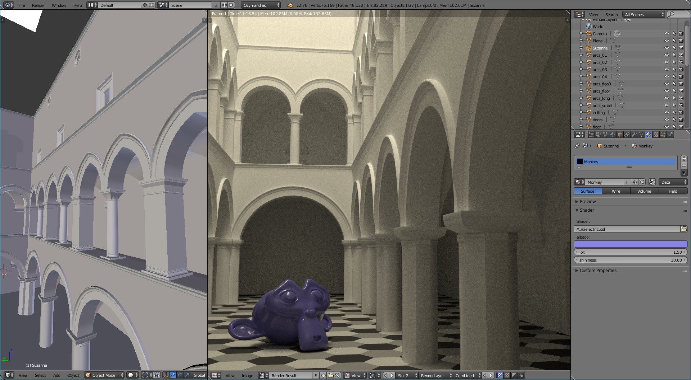

Ozymandias
------

A simple path tracer with c,c++ and python bindings.

See frontends/ for example usage and a blender addon.

###Dependencies
Ozymandias depends on
* Open Shading Language
* Open Image IO
* Embree

